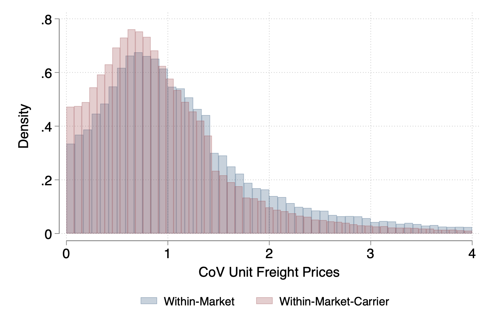

---

##### Download

+ [Paper](CERT.pdf)
<!--+ [Online appendix](appendix1.pdf)
#+ [Code and data](https://github.com/pmichaillat/feru)-->

---

##### Abstract
 We study how the interplay between oligopoly in the transportation industry and
 oligopsony power retained by non-atomistic importers affects the transmission of trade
 policy. Using Chilean customs data, we document strong concentration among carriers
 and importers and show that freight prices are determined through bilateral bargaining
 under two-sided market power. We estimate a trade model that endogenizes transporta
tion costs by embedding oligopoly and oligopsony in the transport sector, along with
 bilateral bargaining. We find sizable carrier markups, partially offset by importer bargain
ing power. Embedding this mechanism into a quantitative trade model, we find that the
 endogenous response of transportation costs reduces the welfare cost of tariffs by 50%
 compared to the standard case of iceberg trade costs. This effect is primarily driven by
 decreasing returns to scale in carriers’ supply. Bargaining, in turn, plays a central role in
 shaping price levels and market allocations in the transportation sector.
---

##### Figure 1: Rejecting Uniform Pricing



---

##### Citation

Cristoforoni E., Errico M., Rodari F. and  Edoardo Tolva. 2025. "Oligopolies in Trade and Transportation:
Implications for the Gains from Trade." *Working Paper*.

```BibTeX
@article{UI13,
author = {Enrico Cristoforoni, Marco Errico, Federico Rodari, Edoardo Tolva},
year = {2025},
title ={Oligopolies in Trade and Transportation:
Implications for the Gains from Trade},
journal = {Working Paper},
volume = {},
number = {},
pages = {},
url = {}}
```

---

<!--+##### Related material

+ [Presentation slides](presentation1.pdf)
+ [Summary of the paper](https://www.penguinrandomhouse.com/books/110403/unusual-uses-for-olive-oil-by-alexander-mccall-smith/)-->
