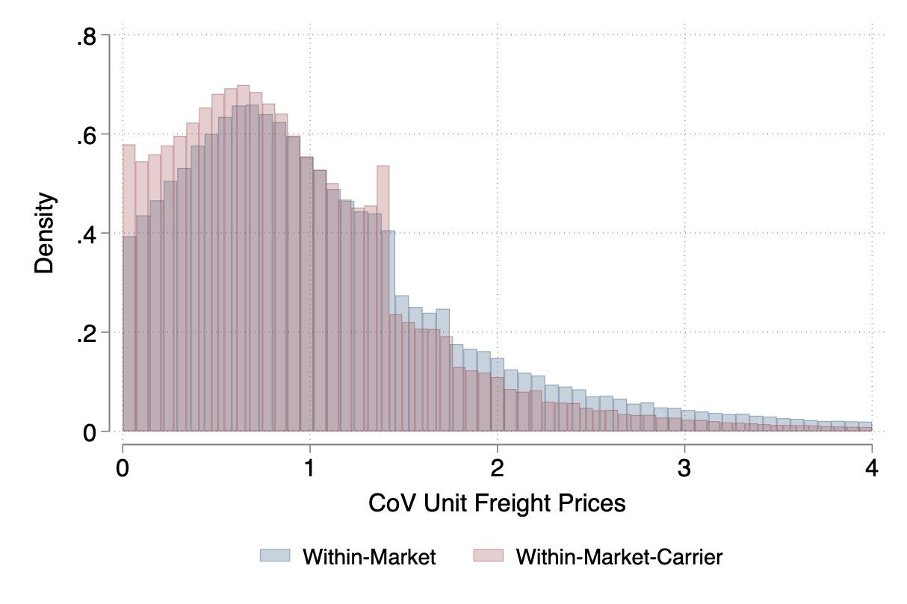

---

##### Download

+ [Paper](Transportation_Oct24.pdf)
<!--+ [Online appendix](appendix1.pdf)
#+ [Code and data](https://github.com/pmichaillat/feru)-->

---

##### Abstract

Transportation services are crucial for goods to move globally; however, given the concentration in the industry, the realized gains from trade are smaller due to the presence of market power. We study the interplay between oligopoly in the transportation industry and oligopsony power retained by non-atomistic importers. We leverage transaction-level data from Chilean customs to document several empirical facts: (i) market concentration in the transportation sector and among importers, and (ii) that transportation prices are highly dispersed and are the outcome of bilateral negotiations. We then develop a trade model that departs from the usual iceberg cost assumption and allows for two-sided market power in the transportation industry. We find that transport carriers charge large markups, but importers benefit from substantial bargaining power. Finally, we embed the bilateral bargaining framework into a quantitative trade model of importing. We show that market concentration reduces the pass-through of tariff shocks to gains from trade, and that the welfare implications of trade liberalization are different when accounting for the strategic interaction between the transportation sector and importers.

---

##### Figure 1: Rejecting Uniform Pricing



---

##### Citation

Cristoforoni E., Errico M., Rodari F. and  Edoardo Tolva. 2024. "Oligopolies in Trade and Transportation:
Implications for the Gains from Trade." *Working Paper*.

```BibTeX
@article{UI13,
author = {Enrico Cristoforoni, Marco Errico, Federico Rodari, Edoardo Tolva},
year = {2024},
title ={Oligopolies in Trade and Transportation:
Implications for the Gains from Trade},
journal = {Working Paper},
volume = {},
number = {},
pages = {},
url = {}}
```

---

<!--+##### Related material

+ [Presentation slides](presentation1.pdf)
+ [Summary of the paper](https://www.penguinrandomhouse.com/books/110403/unusual-uses-for-olive-oil-by-alexander-mccall-smith/)-->
